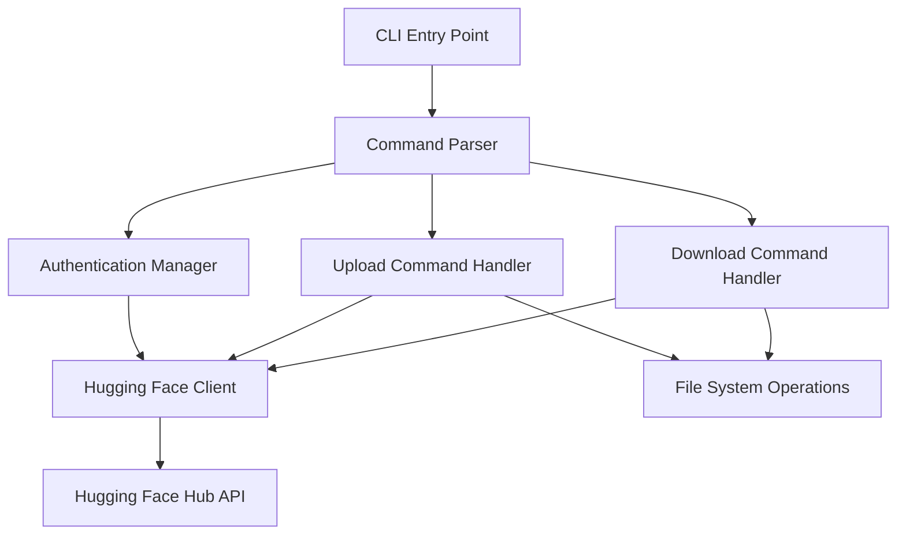

# Design Document

## Overview

The `hfjscli` is a Node.js command-line interface that provides a streamlined way to upload and download files from the Hugging Face Hub. The tool is designed as a lightweight alternative to the Python `hf` CLI, focusing specifically on file operations while maintaining compatibility with Hugging Face authentication and repository structures.

The CLI will be built using modern Node.js practices with TypeScript for type safety, leveraging the official @huggingface/hub JavaScript library for API interactions, and following established CLI design patterns for excellent user experience.

## Architecture

### High-Level Architecture



### Core Components

1. **CLI Entry Point**: Main executable that handles global options and routes to specific commands
2. **Command Parser**: Handles argument parsing and validation using a CLI framework
3. **Authentication Manager**: Manages Hugging Face tokens and authentication state
4. **Command Handlers**: Separate handlers for upload and download operations
5. **Hugging Face Client**: Wrapper around @huggingface/hub library
6. **File System Operations**: Utilities for file handling and validation

## Components and Interfaces

### CLI Framework

- **Library**: `commander.js` for robust command-line parsing
- **Features**: Subcommands, option parsing, help generation, version management

### Authentication System

```typescript
interface AuthConfig {
  token?: string;
  source: 'flag' | 'env' | 'config';
}

interface AuthManager {
  getToken(): Promise<string | null>;
  validateToken(token: string): Promise<boolean>;
  setToken(token: string): void;
}
```

### Command Interfaces

```typescript
interface UploadOptions {
  repoId: string;
  filePath: string;
  token?: string;
  message?: string;
  repoType: 'model' | 'dataset' | 'space';
  verbose: boolean;
}

interface DownloadOptions {
  repoId: string;
  filePath: string;
  localDir?: string;
  token?: string;
  repoType: 'model' | 'dataset' | 'space';
  verbose: boolean;
}
```

### Hugging Face Client Wrapper

```typescript
interface HFClientWrapper {
  uploadFile(options: UploadOptions): Promise<UploadResult>;
  downloadFile(options: DownloadOptions): Promise<DownloadResult>;
  validateRepository(repoId: string, repoType: string): Promise<boolean>;
}
```

## Data Models

### Configuration Model

```typescript
interface CLIConfig {
  defaultRepoType: 'model' | 'dataset' | 'space';
  defaultToken?: string;
  verboseLogging: boolean;
}
```

### Operation Results

```typescript
interface UploadResult {
  success: boolean;
  fileUrl?: string;
  commitSha?: string;
  error?: string;
}

interface DownloadResult {
  success: boolean;
  localPath?: string;
  fileSize?: number;
  error?: string;
}
```

### Error Types

```typescript
enum ErrorType {
  AUTHENTICATION_ERROR = 'auth_error',
  NETWORK_ERROR = 'network_error',
  FILE_NOT_FOUND = 'file_not_found',
  PERMISSION_ERROR = 'permission_error',
  VALIDATION_ERROR = 'validation_error',
  RATE_LIMIT_ERROR = 'rate_limit_error'
}

interface CLIError {
  type: ErrorType;
  message: string;
  details?: string;
  suggestions?: string[];
}
```

## Error Handling

### Error Categories and Responses

1. **Authentication Errors**
   - Invalid or missing tokens
   - Expired credentials
   - Insufficient permissions
   - Response: Clear error message with authentication instructions

2. **Network Errors**
   - Connection timeouts
   - API unavailability
   - Rate limiting
   - Response: Retry suggestions and status information

3. **File System Errors**
   - File not found locally
   - Permission denied
   - Disk space issues
   - Response: Specific file path information and resolution steps

4. **Validation Errors**
   - Invalid repository IDs
   - Unsupported file types
   - Invalid command arguments
   - Response: Detailed validation messages with examples

### Error Handling Strategy

```typescript
class ErrorHandler {
  static handle(error: CLIError): void {
    // Display user-friendly error message
    // Provide actionable suggestions
    // Log detailed error information in verbose mode
    // Exit with appropriate error code
  }
}
```

## Testing Strategy

### Unit Testing

- **Framework**: Jest with TypeScript support
- **Coverage**: All command handlers, authentication logic, and utility functions
- **Mocking**: Mock @huggingface/hub library calls and file system operations

### Integration Testing

- **Scope**: End-to-end command execution with mocked API responses
- **Test Cases**:
  - Successful upload/download scenarios
  - Authentication failure scenarios
  - Network error scenarios
  - File system error scenarios

### Test Structure

```
tests/
├── unit/
│   ├── auth.test.ts
│   ├── upload.test.ts
│   ├── download.test.ts
│   └── utils.test.ts
├── integration/
│   ├── cli.test.ts
│   └── commands.test.ts
└── fixtures/
    ├── sample-files/
    └── mock-responses/
```

### Testing Approach

1. **Isolated Unit Tests**: Test individual functions and classes in isolation
2. **Command Integration Tests**: Test complete command flows with mocked dependencies
3. **Error Scenario Testing**: Comprehensive testing of all error conditions
4. **CLI Interface Testing**: Validate command-line argument parsing and help output

## Implementation Considerations

### Dependencies

- **@huggingface/hub**: Official Hugging Face JavaScript library
- **commander**: CLI framework for Node.js
- **chalk**: Terminal styling for better user experience
- **ora**: Elegant terminal spinners for progress indication
- **fs-extra**: Enhanced file system operations

### Project Structure

```
src/
├── index.ts              # CLI entry point
├── commands/
│   ├── upload.ts         # Upload command handler
│   ├── download.ts       # Download command handler
│   └── base.ts          # Base command class
├── auth/
│   └── manager.ts       # Authentication management
├── client/
│   └── hf-client.ts     # Hugging Face client wrapper
├── utils/
│   ├── errors.ts        # Error handling utilities
│   ├── files.ts         # File system utilities
│   └── logger.ts        # Logging utilities
└── types/
    └── index.ts         # TypeScript type definitions
```

### Configuration Management

- Environment variable support (`HF_TOKEN`)
- Command-line flag precedence
- Validation of all configuration sources

### User Experience Enhancements

- Progress indicators for file operations
- Colored output for better readability
- Detailed verbose logging option
- Comprehensive help documentation
- Intuitive error messages with suggestions
